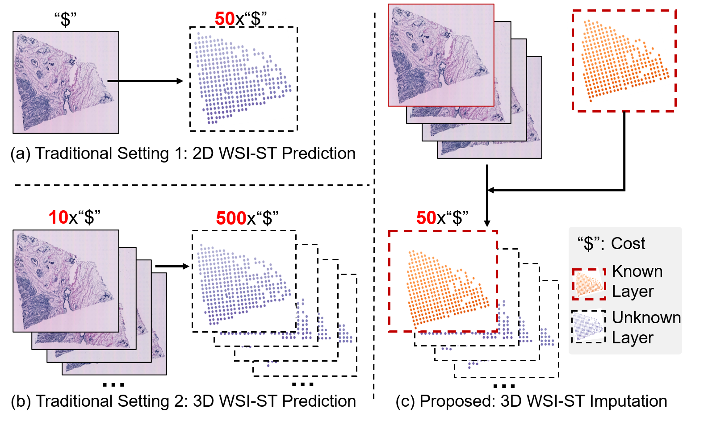

# ASIGN: Anatomy-aware Spatial Imputation Graphic Network for 3D Spatial Transcriptomics (CVPR 2025)

[Arxiv Paper](https://arxiv.org/abs/2412.03026) [CVPR 2025]

This project consists of the official implementation of ASIGN, which is an anatomy-aware spatial imputation graphic network for 3D Spatial Transcriptomics. **Our paper has been accepted by CVPR 2025!**

1. [Abstract](#Abstract)
2. [Implementation](#Implementation)
3. [Result](#Result)

## Abstract

Our proposed ASGIN framework is a novel framework for 3D-ST prediction that transforms isolated 2D spatial relationships into a cohesive 3D structure through inter-layer overlap and similarity, integrating 3D spatial information into 3D-ST imputation. Our contribution can be summarized as:

- We introduce a new learning paradigm that shifts from 2D WSI-ST predictions to partially known 3D volumetric WSI-ST imputation.
- A new multi-level spatial attention graphic network is proposed to facilitate comprehensive feature integration across different layers, neighboring regions, and multiple resolutions, thus enabling precise sample-level predictions.



## Implementation

### 1. Data preparation

- Data preparation includes two parts. 
  - Data construction for 2D patches
  - 3D data pre-processing


#### 1.1 Preparation for 2D multi-resolution patches

Code for preparation for 2D multi-resolution patches consists in folder `data_preprocessing`. Running these python files following the annotated sequence.

Note that different datasets may have different format in their raw data, please modify the code when applying the code for other datasets.

1. Patch cropping for region/global level patches.

```
python 1_cropped_multi_level_patch.py
```

2. Find the pair of spot and region/global level patches, and filter the region/global level patches.

 ```
 python 2_find_512_pair.py
 python 3_find_1024_pair.py
 ```

3. Extract feature from patches of different resolutions

 ```
 python 4_feature_extraction.py
 ```

4. Gene expression preprocessing, we follow the normalization method proposed by [ST-Net](https://www.nature.com/articles/s41551-020-0578-x).

 ```
 python 5_1_find_high_expression.py
 python 5_2_get_label_of_other_resolution.py
 python 5_3_normalization.py
 ```

5.  Graph construction for region/global level

 ```
 python 6_pt_construction.py
 ```

6. Final step for 2D level preprocessing, get the 2D data information

 ```
 python 7_make_dataset.py
 ```

In this [link](https://drive.google.com/file/d/146qKW-qFNuF9HNH5igSMeeizKBomwXyn/view?usp=sharing), we provide you with a set of sample file formats generated during the preprocessing process for you to check whether the preprocessing phase is correct

------

### 1.2 3D Registration for samples

Code for preparation for 3D registration for samples consists in folder `registration`. Running these python files following the annotated sequence.

Note: please modify the image folder path for your data.

- Download `ANTs` from:

  ```
  https://github.com/ANTsX/ANTs
  ```

- Run the python files following the steps to get overlap information

  ```bash
  python Step1_affine_registration_2d_PAS_2048_xfeat.py
  ...
  python Step3.5_registertoMiddle_ANTs_points_contour_fast.py
  ```

------

### 1.3 Preparation for 3D sample-level dataset

Code for preparation for 3D sample-level dataset consists in folder `data_preprocessing_3d`. Running these python files following the annotated sequence.

1. Calculate IoU and similarity of spots cross layers

   ```
   python 1_get_iou.py
   python 2_get_similarity.py
   ```

2. Build up edge weight between spots

   ```
   python 3_build_3d_information.py
   ```

3. Combine sample-level graph and information

   ```
   python 4_build_3d_graph.py
   python 5_build_3d_final_format.py
   ```

------

### 2 Pre-processed public datasets

For your convenience, we have released two processed public datasets `HER2` and `ST-data` for you to reproduce our results. The related data source are listed as follows:

- **HER2 dataset:** [Processed HER2 data](https://drive.google.com/file/d/1d1LTv-GyxMfZYfem0akVgnY5sRTwtDDE/view?usp=sharing), [Raw HER2 data](https://zenodo.org/records/4751624), [HER2 paper link](https://www.nature.com/articles/s41467-021-26271-2)
- **ST Data:**  [Processed ST Data data](https://drive.google.com/file/d/11-7THZHskhcSYtslgVwI7J1n2kIc44Dx/view?usp=sharing), [Raw ST Data data](https://data.mendeley.com/datasets/29ntw7sh4r/5), [ST Data paper link](https://www.nature.com/articles/s41551-020-0578-x)

------

### 3 Training and Evaluation

MSAGNet comprises cross-attention layers, GAT blocks, and Transformer layers to integrate and aggregate features across multiple resolution levels, 3D sample levels, and patch-self levels, respectively. 

**Note:** Since different datasets have different name format, the path of some files used in `dataloader_3d.py` and `main_3d.py` need to be changed for your files. Also, to achieve best performance in your dataset, please finetune the hyperparameters used in`dataloader_3d.py` and `main_3d.py`.


#### Training Implementation

- To train ASIGN on 2D-level prediction, run `main.py`:

  ```bash
  CUDA_VISIBLE_DEVICES=0 python main.py --root_path '' --base_lr 0.001 --batch_size 128
  ```

- To train ASIGN on 3D-level prediction, run `main_3d.py`:

  ```bash
  CUDA_VISIBLE_DEVICES=0 python main_3d.py --root_path '' --base_lr 0.001 --batch_size 128
  ```
------

## Result

Experimental results demonstrate ASIGN's superior performance and robust generalization in cross-sample validation across multiple public datasets, significantly improving the PCC metric for gene expression tasks from approximately 0.5 with existing methods to around 0.7. ASIGN offers a promising pathway to achieve accurate and cost-effective 3D ST data for real-world clinical applications.


------

## Citation

If you find this project useful for your research, please use the following BibTeX entry.

```
@article{zhu2024asign,
  title={ASIGN: An Anatomy-aware Spatial Imputation Graphic Network for 3D Spatial Transcriptomics},
  author={Zhu, Junchao and Deng, Ruining and Yao, Tianyuan and Xiong, Juming and Qu, Chongyu and Guo, Junlin and Lu, Siqi and Yin, Mengmeng and Wang, Yu and Zhao, Shilin and others},
  journal={arXiv preprint arXiv:2412.03026},
  year={2024}
}
```
