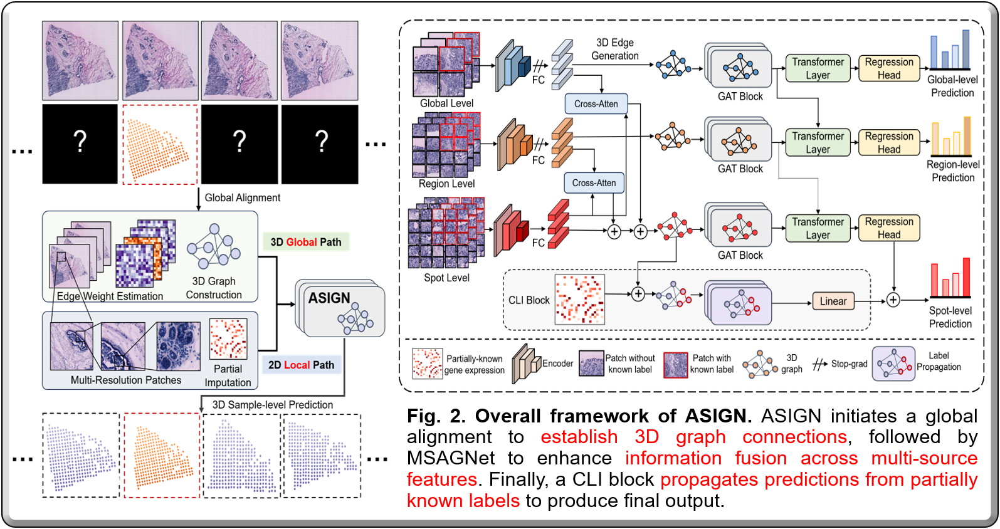

This project consists of the implementation of ASIGN, which is an anatomy-aware spatial imputation graphic network for 3D Spatial Transcriptomics.

Our proposed ASGIN framework isa novel framework for 3D-ST prediction that transforms isolated 2D spatial relationships into a cohesive 3D structure through inter-layer overlap and similarity, integrating 3D spatial information into 3D-ST imputation. Our contribution can be summarized as:

- We introduce a new learning paradigm that shifts from 2D WSI-ST predictions to partially known 3D volumetric WSI-ST imputation.
- A new multi-level spatial attention graphic network is proposed to facilitate comprehensive feature integration across different layers, neighboring regions, and multiple resolutions, thus enabling precise sample-level predictions.



## Implementation

### 1. Data preparation

#### 1.1 Preparation for 2D multi-resolution patches

Code for preparation for 2D multi-resolution patches consists in folder `data_preprocessing`. Running these python files following the annotated sequence.

- `Patch cropping`: 

  Change the input path and output path, and run:

  ```bash
  python 1_cropped_multi_level_patch.py
  ```

- `Pair finding`:

  Change the file path and run:

  ```bash
  python 2_find_512_pair.py
  python 3_find_1024_pair.py
  ```

- `Get label and features `:

  ```bash
  python 4_feature_extraction.py
  python 5_get_label.py
  ```

- `Make 2D multi-resolution dataset`:

  ```bash
  python 6_pt_construction.py
  python 7_make_dataset.py
  ```

### 1.2 Preparation for 3D sample-level dataset

Code for preparation for 3D sample-level dataset consists in folder `data_preprocessing_3d`. Running these python files following the annotated sequence.

- `Similarity and IoU calculation`:

  ```bash
  python 1_get_iou.py
  python 2_get_similarity.py
  ```

- `3D graph and data information generation`:

  ```bash
  python 3_build_3d_information.py
  python 4_build_3d_graph.py
  python 5_build_3d_final_format.py
  ```

### 2 Training and Evaluation

MSAGNet comprises cross-attention layers, GAT blocks, and Transformer layers to integrate and aggregate features across multiple resolution levels, 3D sample levels, and patch-self levels, respectively. 


#### 2.1 Training Implementation

- To train ASIGN on 2D-level prediction, run `main.py`:

  ```bash
  CUDA_VISIBLE_DEVICES=0 python main.py --root_path '' --base_lr 0.0001 --batch_size 128
  ```

- To train ASIGN on 3D-level prediction, run `main_3d.py`:

  ```bash
  CUDA_VISIBLE_DEVICES=0 python main_3d.py --root_path '' --base_lr 0.0001 --batch_size 128
  ```

#### 2.2 Prediction Implementation

- To test ASIGN on 2D-level prediction, run `prediction.py`:

  ```bash
  CUDA_VISIBLE_DEVICES=0 python prediction.py --root_path ''
  ```

- To test ASIGN on 3D-level prediction, run `prediction_3d.py`:

  ```bash
  CUDA_VISIBLE_DEVICES=0 python prediction_3d.py --root_path ''
  ```

### 3 Result

Experimental results demonstrate ASIGN's superior performance and robust generalization in cross-sample validation across multiple public datasets, significantly improving the PCC metric for gene expression tasks from approximately 0.5 with existing methods to around 0.7. ASIGN offers a promising pathway to achieve accurate and cost-effective 3D ST data for real-world clinical applications.


